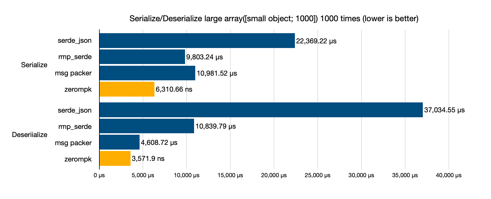

# zerompk

A zero-copy, zero-dependency, no_std-compatible, extremely fast MessagePack serializer for Rust.

[](https://crates.io/crates/zerompk)
[](https://docs.rs/zerompk)



## Overview

zerompk is a high-performance MessagePack serializer for Rust. Compared to [rmp_serde](https://github.com/3Hren/msgpack-rust), it operates approximately 1.3 to 3.0 times faster and is implemented without relying on any libraries, including `std`.

## Quick Start

```rust
use zerompk::{FromMessagePack, ToMessagePack};

#[derive(FromMessagePack, ToMessagePack)]
pub struct Person {
    pub name: String,
    pub age: u32,
}

fn main() {
    let person = Person {
        name: "Alice",
        age: 18,
    };
    
    let msgpack: Vec<u8> = zerompk::to_msgpack_vec(&person).unwrap();
    let person: Person = zerompk::from_msgpack(&msgpack).unwrap();
}
```

## Format

The correspondence between Rust types and MessagePack types in zerompk is as follows. Since MessagePack uses variable-length encoding, zerompk serializes values into the smallest possible type based on their size.

| Rust Type                                                                                      | MessagePack Type                                                            |
| ---------------------------------------------------------------------------------------------- | --------------------------------------------------------------------------- |
| `bool`                                                                                         | `true`, `false`                                                             |
| `u8`, `u16`, `u32`, `u64`, `usize`                                                             | `positive fixint`, `uint 8`, `uint 16`, `uint 32`, `uint 64`                |
| `i8`, `i16`, `i32`, `i64`, `isize`                                                             | `positive fixint`, `negative fixint`, `int 8`, `int 16`, `int 32`, `int 64` |
| `f32`, `f64`                                                                                   | `float 32`, `float 64`                                                      |
| `str`, `String`                                                                                | `fixstr`, `str 8`, `str1 6`, `str 32`                                       |
| `[u8]`                                                                                         | `bin 8`, `bin 16`, `bin 32`                                                 |
| `&[T]`, `Vec<T>`, `VecDeque<T>`, `LinkedList<T>`, `HashSet<T>`, `BTreeSet<T>`, `BinaryHeap<T>` | `fixarray`, `array 16`, `array 32`                                          |
| `HashMap<K, V>`, `BTreeMap<K, V?`                                                              | `fixmap`, `map 16`, `map 32`                                                |
| `()`                                                                                           | `nil`                                                                       |
| `Option<T>`                                                                                    | `nil` (`None`) or `T` (`Some(T)`)                                           |
| `(T0, T1)`, `(T0, T1, T2)`, ...                                                                | `fixarray`, `array 16`, `array 32`                                          |
| `DateTime<Utc>`, `NaiveDateTime` (chrono)                                                      | `timestamp 32`, `timestamp 64`, `timestamp 96` (ext -1)                     |
| struct (default, with `#[msgpack(array)]`)                                                     | `fixarray`, `array 16`, `array 32`                                          |
| struct (with `#[msgpack(map)]`)                                                                | `fixmap`, `map 16`, `map 32`                                                |
| enum                                                                                           | `fixarray` (`[tag, value]`)                                                 |

## derive

By enabling the `derive` feature flag, you can implement `FromMessagePack`/`ToMessagePack` using the `derive` macro.

```rust
#[derive(FromMessagePack, ToMessagePack)]
pub struct Person {
    pub name: String,
    pub age: u32,
}
```

You can also customize the serialization format using the `#[msgpack]` attribute.

### array/map

The serialization format of structs and enum variants can be chosen from `array` or `map`. For performance reasons, the default is set to `array`.

```rust
#[derive(FromMessagePack, ToMessagePack)]
#[msgpack(array)] // default
pub struct PersonArray {
    pub name: String,
    pub age: u32,
}

#[derive(FromMessagePack, ToMessagePack)]
#[msgpack(map)]
pub struct PersonMap {
    pub name: String,
    pub age: u32,
}
```

### key

You can override the index/key used for fields or enum variants. For `array`, integers are used, and for `map`, strings are used. If the format is `array` and there are gaps in the indices, `nil` is automatically inserted.

```rust
#[derive(FromMessagePack, ToMessagePack)]
pub struct Person {
    #[msgpack(key = 0)]
    pub name: String,

    #[msgpack(key = 2)]
    pub age: u32,
}
```

> [!NOTE]
> To enhance versioning resilience, it is recommended to explicitly set keys whenever possible.

### ignore

Set `ignore` for fields you want to exclude during serialization/deserialization. When deserializing a struct with `ignore`, the type of the `ignore` field must implement `Default`.

```rust
#[derive(FromMessagePack, ToMessagePack)]
pub struct Person {
    pub name: String,
    pub age: u32,

    #[msgpack(ignore)]
    pub meta: Metadata,
}
```

## Design Philosophy

The most popular MessagePack serializer, [rmp](https://github.com/3Hren/msgpack-rust), is highly optimized, but zerompk is designed with an even greater focus on performance.

### No Serde

Serde is an excellent abstraction layer for serializers, but it comes with a (slight but non-negligible for serializers) performance cost. Since zerompk is a serializer specialized for MessagePack, it does not use Serde traits.

For example, let's compare the generated code for the following derive macro:

```rust
use serde::{Deserialize, Serialize};
use zerompk::{FromMessagePack, ToMessagePack};

#[derive(Serialize, Deserialize, FromMessagePack, ToMessagePack)]
pub struct Point {
    pub x: i32,
    pub y: i32,
}
```

<details>

<summary>Serde</summary>

```rust
...Serde generated code...
```

</details>

<details>

<summary>zerompk</summary>

```rust
impl ::zerompk::ToMessagePack for Point {
    fn write<W: ::zerompk::Write>(
        &self,
        writer: &mut W,
    ) -> ::core::result::Result<(), ::zerompk::Error> {
        writer.write_array_len(2usize)?;
        self.x.write(writer)?;
        self.y.write(writer)?;
        Ok(())
    }
}

impl<'__msgpack_de> ::zerompk::FromMessagePack<'__msgpack_de> for Point {
    fn read<R: ::zerompk::Read<'__msgpack_de>>(
        reader: &mut R,
    ) -> ::core::result::Result<Self, ::zerompk::Error>
    where
        Self: Sized,
    {
        reader.increment_depth()?;
        let __result = {
            reader.check_array_len(2usize)?;
            Ok(Self {
                x: <i32 as ::zerompk::FromMessagePack<'__msgpack_de>>::read(reader)?,
                y: <i32 as ::zerompk::FromMessagePack<'__msgpack_de>>::read(reader)?,
            })
        };
        reader.decrement_depth();
        __result
    }
}
```

</details>

Compared to the complex visitor generated by Serde, zerompk's code is extremely simple. This not only benefits runtime performance but also reduces binary size and compile time as a side effect.

Of course, zerompk also supports Serde's `Serialize`/`Deserialize`. However, in performance-critical scenarios, it is recommended to use `FromMessagePack`/`ToMessagePack`.

### Zero Copy

Like Serde, zerompk supports zero-copy deserialization, directly referencing the original serialized data.

```rust
#[derive(ToMessagePack, FromMessagePack)]
pub struct NoCopy<'a> {
    pub str: &'a str,
    pub bin: &'a [u8],
}

fn main() -> Result<()> {
    let value = NoCopy {
        str: "hello",
        bin: &[0x01, 0x02, 0x03],
    };
    let msgpack = zerompk::to_msgpack_vec(&value)?;
    let value: NoCopy = zerompk::from_msgpack(data)?;
}
```

Due to constraints in the MessagePack format, zero-copy deserialization is limited to `&str` and `&[u8]`. As a result, zerompk's performance is lower compared to formats like [rkyv](https://github.com/rkyv/rkyv) or [bincode](https://github.com/bincode-org/bincode). (However, compared to these formats, MessagePack is self-descriptive and excels in versatility for inter-language operations.)

### Other Optimizations

zerompk improves performance through various optimizations:

- Aggressive inlining to reduce function calls
- Elimination of unnecessary boundary checks using `unsafe` code
- Minimization of intermediate layers with `zerompk::{Read, Write}`
- Automaton-based string search for faster deserialization of map formats

Many of these optimizations are inspired by the high-performance MessagePack serializer [MessagePack-CSharp](https://github.com/MessagePack-CSharp/MessagePack-CSharp).

## Benchmarks

> [!NOTE]
> [msgpacker](https://github.com/codx-dev/msgpacker) is described as a MessagePack serializer, but it does not produce correct MessagePack binaries. In msgpacker, structs are always represented as arrays, but the discriminating header is omitted. Therefore, binaries serialized by msgpacker are not compatible with properly implemented MessagePack serializers, making strict comparisons invalid.

### Serialize/Deserialize Struct (with 4 fields, array format) 1000 times

| Crate               | Serialize | Deserialize |
| ------------------- | --------: | ----------: |
| `serde_json` (JSON) |  98.33 μs |   329.12 μs |
| `msgpacker`         |  25.41 μs |   134.37 μs |
| `rmp_serde`         |  56.22 μs |    97.00 μs |
| `zerompk`           |  12.38 μs |    72.27 μs |

### Serialize/Deserialize Struct (with 4 fields, map format) 1000 times

| Crate              | Serialize | Deserialize |
| ------------------ | --------: | ----------: |
| `serde_json`(JSON) |  98.33 μs |   329.12 μs |
| `rmp_serde`        |  92.63 μs |    98.31 μs |
| `zerompk`          |  18.76 μs |    71.19 μs |
| `msgpacker`        |       N/A |         N/A |

### Serialize/Deserialize Array (struct with 2 fields, 1000 elements) 1000 times

| Crate              |    Serialize |  Deserialize |
| ------------------ | -----------: | -----------: |
| `serde_json`(JSON) | 22,369.22 μs | 37,034.55 μs |
| `rmp_serde`        |  9,803.24 μs | 10,839.79 μs |
| `msgpacker`        | 10,981.52 μs |  4,608.72 μs |
| `zerompk`          |  6,310.66 μs |  4,074.17 μs |

### Serialize/Deserialize Struct (with 2 fields, no-copy) 1000 times

| Crate       | Serialize | Deserialize |
| ----------- | --------: | ----------: |
| `rmp_serde` |  15.47 μs |    16,82 μs |
| `zerompk`   |   8.57 μs |    10.33 μs |

## Security

zerompk always requires strict type schemas for serialization/deserialization, making it almost safe against untrusted binaries. Additionally, zerompk implements measures against the following attacks:

- Stack overflow caused by excessive object nesting. zerompk rejects objects nested beyond `MAX_DEPTH = 500` and returns an error.
- Memory consumption due to large size headers. zerompk validates header sizes before memory allocation and returns an error if the buffer is insufficient.

However, note that these measures are for general attacks and do not validate the data itself. When deserializing untrusted data, ensure proper authentication on the application side.

## License

This library is released under the [MIT License](LICENSE).
